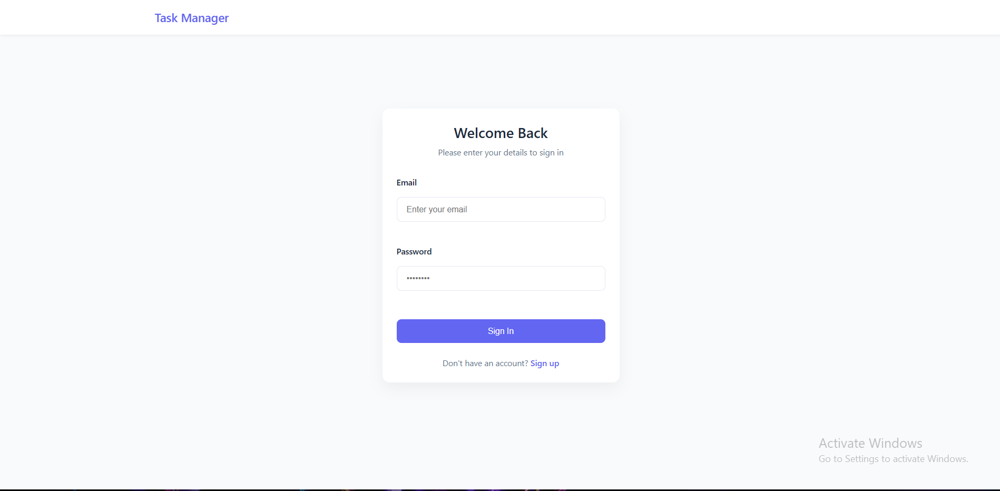

# Task Manager - MERN Stack Application


## ✨ Features
- 🔐 JWT Authentication (Login/Register)
- ✅ Create, Read, Update, Delete Tasks
- 📅 Sort by Due Date/Priority
- 🎨 Responsive Design

## 🛠️ Installation

### Prerequisites
- Node.js v16+
- MongoDB (Local or Atlas)
- Git

### Local Developmen
1. Clone the repo:
   ```bash
   git clone https://github.com/YOUR_USERNAME/task-manager.git
   cd task-manager

2. Set up backend:
   cd backend
   npm install
   cp .env.example .env  # Edit with your MongoDB URI
   npm run dev

3. Set up frontend:
   cd ../frontend
   npm install
   cp .env.example .env  # Set API URL (http://localhost:5000)
   npm start 

   Docker Setup
docker-compose up --build
Access at: http://localhost:3000

🌐 Live Demo
Frontend: [Vercel App](https://task-manager-git-main-thisarashehankavindas-projects.vercel.app)

Backend: Render Service

📚 API Documentation
Explore API endpoints:
🔗 [Swagger UI](http://localhost:5000/api-docs/)

🚀 Deployment
Deploy to Render

📸 Screenshots
Login Page	Task Dashboard  Register Page  Create task page
	   


🤝 Contributing
Pull requests welcome!

Fork the project

Create your branch (git checkout -b feature/AmazingFeature)

Commit changes (git commit -m 'Add feature')

Push (git push origin feature/AmazingFeature)

Open a PR

📜 License
MIT  
